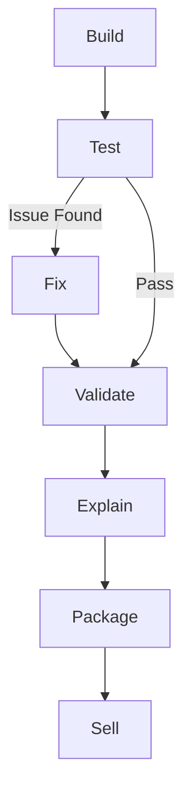

# Prompt Workflow

## Files

- `query_rewrite_prompt.txt`: rewrites the raw request into a clearer analysis task.
- `plan_prompt.txt`: creates the step-by-step analysis plan.
- `master_prompt.txt`: generates Python code from the clarified task and dataframe context.
- `error_prompt.txt`: fixes runtime failures when execution crashes.
- `quality_check_prompt.txt`: validates whether the computed result answers the task.
- `solution_explanation_prompt.txt`: explains how the system solved the query.
- `simple_summary_prompt.txt`: summarizes the result for a non-technical user.
- `response_format_prompt.txt`: packages the result into a structured response.
- `insight_prompt.txt`: turns the result into concise business insights.
- `business_strategy_prompt.txt`: converts the result into actionable business decisions.
- `storytelling_prompt.txt`: turns the result into a short narrative with a recommendation.

## Intended Flow

1. Build the analysis by rewriting the query, generating a plan, and producing Python code.
2. Test the generated code with a first execution attempt.
3. If the first run fails, fix the code and retry execution.
4. Validate whether the final result actually answers the user query.
5. Explain the result with a plain-language summary and step-by-step reasoning.
6. Package the answer into a clean, structured response.
7. Sell the outcome with insights, business actions, and a concise narrative.
